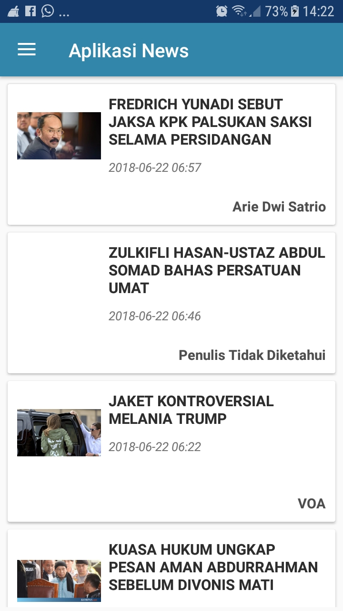
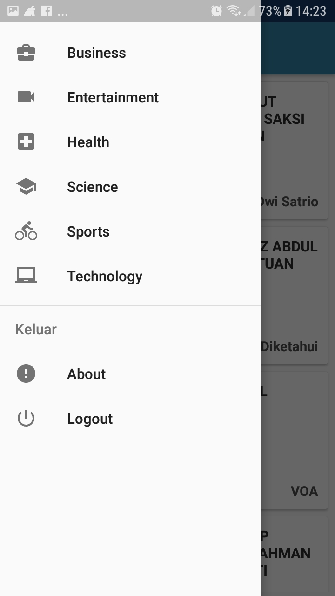
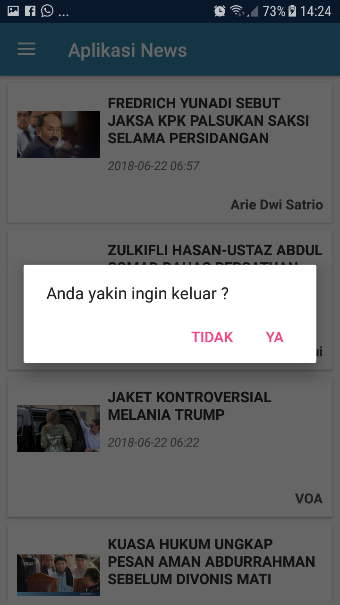

# AplikasiNews

Aplikasi berita di indonesia menggunakan API dari https://newsapi.org/


## Screenshots

<pre>
                           
</pre>

### Fitur aplikasi

* [x] Terdapat fitur untuk mencari semua jenis berita
* [x] Halaman detail untuk menampilkan detail berita yang telah dipilih pada halaman list berita.
* [x] Tampilan poster dari berita.
* [x] Navigasi untuk halaman setiap category berita.
* [x] Menggunakan recyclerview untuk menampilkan data bisa berupa list, atau card.
* [x] Pada halaman detail berita menggunakan fitur colapsing toolbar.
* [x] Pada halaman awal (home) ketika user menekan tombol back button dari hp, tidak akan langsung keluar jika tidak menekannya 2 kali secara berturut-turut.
* [X] Pada bagian logout, menggunakan fitur alert dialog.

### Petunjuk menjalankan source code aplikasi
Untuk menjalankan source code aplikasi ini, anda perlu registrasi API KEY dari https://newsapi.org/
kemudian memasukkan API KEY yang telah didapat ke dalam file ***gradle.properties***

```
NewsApiToken="Masukan API KEY anda disini"
```

Kemudian tambah baris berikut pada file ***build.gradle*** dibawah ***buildTypes***

```
buildTypes.each {
        it.buildConfigField 'String', 'NEWS_API_TOKEN', NewsApiToken
    }
```

## Author

* **R Rifa Fauzi Komara**

Jangan lupa untuk follow dan ★
